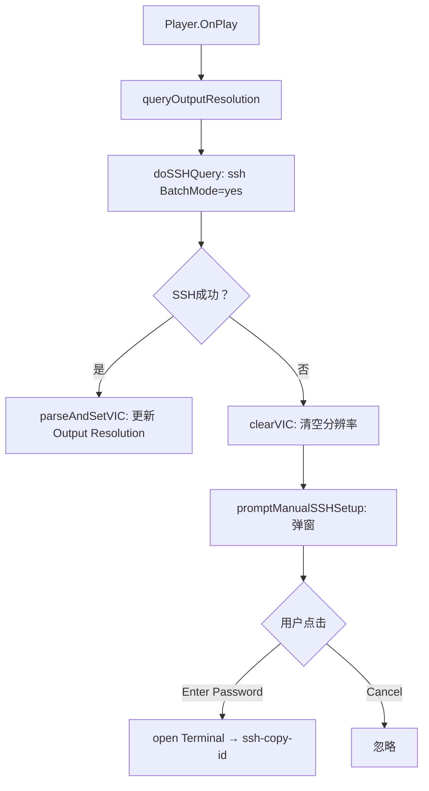

# KODI 控制模块 (WebSocket)

| 项目       | 内容                                                 |
| -------- | -------------------------------------------------- |
| **模块名称** | KODI                                               |
| **类型**   | WebSocket Client                                   |
| **版本**   | 1.3.0                                              |
| **路径**   | ToCenTek                                           |
| **描述**   | 通过 WebSocket 控制 KODI，基于 KODI Websocket API v13.0.0 |
| **官网**   | https://kodi.wiki                                  |

---

## 功能总览

- **播放控制**：播放/暂停、停止、下一曲/上一曲、按索引/按路径播放
- **多种跳转**：秒数步进、百分比、绝对时间、预定义步进
- **播放模式**：循环（单曲/全部/关闭）、随机播放
- **音量控制**：绝对音量、±5%、静音（带静音前音量记忆恢复）
- **3D 模式**：循环/设置 7 种 3D 模式，支持左右眼交换（实验性）
- **宽高比**：单次/多次循环切换多种宽高比
- **视频画面**：缩放、纵向偏移、像素宽高比、非线性拉伸
- **Region & Language**：批量设置语言/时区/时间格式（中文/英文 + 中国/英国时区 + 12/24H）
- **音频设备**：切换音频输出设备（PCM/HDMI/S/PDIF/蓝牙）、切换声道数（2.0–7.1）
- **进度条**：播放进度百分比滑块（可拖动 seek），基于本地帧计数模拟
- **刷新率 & 分辨率**：调整刷新率模式、最小化黑边、4:3 显示模式、高品质缩放器、硬件解码开关、多显示器空白、3:2 pulldown 开关、双倍刷新率开关
- **系统控制**：重启 KODI、待机、重启设备、关机
- **窗口管理**：激活指定窗口（30+ 种窗口类型）、强制全屏
- **通知功能**：右上角弹窗通知（支持从文件读取标题/内容）
- **远程按键**：17+ 种按键/动作发送（↑↓←→ Enter Back Menu OSD 等）
- **视频校准**：按键遥控、导航到校准界面、重置校准
- **播放列表管理**：从指定目录获取文件列表 → 排序 → 逐条添加到播放列表 → 播放结束后自动重建
- **播放列表索引映射**：文件 → 实际索引，播放列表实时显示
- **原始 JSON 命令**：发送任意 JSON-RPC 命令
- **调试信息**：Show Player Process Info / Toggle Info / Debug Info 开关
- **SSH 分辨率检测**：播放开始时通过 SSH 查询 KODI 真实输出分辨率（HDMI VIC），SSH 失败时弹窗引导用户安装 SSH 密钥
- **Zeroconf 设备发现**：自动扫描局域网内 KODI 设备（macOS `dns-sd`，Linux `avahi-browse`），扫描结果动态展示在 Parameters 面板，一键填入 serverPath

---

## 配置要求

### 1. KODI 设置

- 开启 **允许通过 HTTP 远程控制**（设置 → 服务 → 控制）
- WebSocket 端口默认为 `9090`，HTTP 端口为 `8080`
- HTTP Basic Auth（如设置）：默认用户 `kodi`，默认密码 `********`

### 2. KODI 设备 SSH（可选，用于分辨率检测）

- 播放开始时模块会自动通过 SSH 查询真实输出分辨率
- SSH 需在 KODI 设备上开启（已开启）
- 默认连接用户 `root`，默认密码 `coreelec`（如果没有修改过的话）
- 如果 SSH 密钥未安装，模块会弹窗提示，并自动打开终端窗口引导你运行 `ssh-copy-id`
  - **macOS**: 通过 AppleScript 打开 Terminal.app
  - **Linux (Debian 系)**: 自动检测可用终端（x-terminal-emulator → xterm → st → gnome-terminal → xfce4-terminal → lxterminal），打开并执行命令
- `ssh-copy-id` 完成后，下次播放时自动获取分辨率

#### SSH 执行命令

```
ssh -o BatchMode=yes -o ConnectTimeout=5 root@<serverPath> cat /sys/class/amhdmitx/amhdmitx0/config
```

输出解析 `VIC:` 行获取当前视频输出分辨率。

### 3. 模块配置（在 Chataigne 中）

- `Protocol`: Lines
- `autoAdd`: false
- `serverPath`: 修改为你的 KODI 设备 IP 和端口，例如 `192.168.1.100:9090`

### 4. 脚本内置变量（`kodi.js` 顶部）

| 变量               | 默认值               | 说明                       |
| ---------------- | ----------------- | ------------------------ |
| `videoDirectory` | `/storage/videos` | 视频文件目录，`Init` 从此目录读取文件列表 |

---

### 4. Zeroconf 设备发现

| 平台    | 依赖            | 说明                                                  |
| ----- | ------------- | --------------------------------------------------- |
| macOS | 内置（Bonjour）   | `dns-sd` 命令系统自带，无需安装                                |
| Linux | `avahi-utils` | 执行 `sudo apt install avahi-utils` 安装 `avahi-browse` |

点 **Scan** 按钮自动扫描局域网中所有发布 `_xbmc-jsonrpc-h._tcp` 服务的 KODI 设备。

> **注意：** 如果 KODI 设备插着网线而运行 Chataigne 的电脑用 WiFi，或反之，mDNS 多播可能跨不过去，导致 Scan 扫不到该设备。
> 解决方法：在 KODI 设备上开启 avahi reflector：
> 
> ```bash
> ssh root@kodiIP "echo 'enable-reflector=yes' > /storage/.config/avahi-daemon.conf && systemctl restart avahi-daemon"
> ```
> 
> 这会把有线口的 mDNS 广播转发到其他接口，WiFi 端就能扫到了。

## UI 参数（Values）

| 参数名                 | 类型        | 读写  | 描述                                                     |
| ------------------- | --------- | --- | ------------------------------------------------------ |
| `isPaused`          | `Boolean` | 只读  | 是否已暂停                                                  |
| `Play/Pause`        | `Trigger` | 只写  | 切换播放/暂停                                                |
| `File`              | `String`  | 只读  | 当前播放的媒体文件路径                                            |
| `Playing`           | `Float`   | 读写  | 播放进度百分比 0–100，可拖动 seek                                 |
| `Items`             | `String`  | 只读  | 多行文本，显示当前播放列表内容                                        |
| `isLooped`          | `Boolean` | 只读  | `false`=不循环（播完即停回启动页），`true`=单曲循环或列表循环（由 Loop Enum 控制） |
| `Random`            | `Boolean` | 只读  | 随机播放状态                                                 |
| `Debug Info`        | `Boolean` | 读写  | 切换 KODI debug 信息显示开关                                   |
| `Volume`            | `Float`   | 读写  | 音量值 0.0–100.0，滑动条实时同步到 KODI                            |
| `isMuted`           | `Boolean` | 只读  | 是否静音                                                   |
| `Output Resolution` | `String`  | 只读  | 当前实际输出分辨率（来自 SSH 查询），如 `2160p60`、`1080p24`             |

### Values 面板按钮（Triggers）

| 按钮            | 功能          |
| ------------- | ----------- |
| `Play/Pause`  | 切换播放/暂停     |
| `Next`        | 下一曲         |
| `Previous`    | 上一曲         |
| `Fullscreen`  | 强制全屏        |
| `Show Info`   | 显示播放器进程信息   |
| `Toggle Info` | 切换播放器进程信息显示 |

---

## 命令（Commands）

### 主菜单

| 命令名             | 类型  | 参数             | 说明                                                                 |
| --------------- | --- | -------------- | ------------------------------------------------------------------ |
| `Init`          | 触发  | 无              | 初始化：同步音量/播放状态 → 从 `videoDirectory` 获取文件列表 → 清空播放列表 → 逐条添加文件 → 开始播放 |
| `Send Raw JSON` | 事件  | `JSON`: String | 发送原始 JSON-RPC 命令字符串到 KODI                                          |

### 播放控制 (Player)

| 命令名               | 类型     | 参数                  | 说明                 |
| ----------------- | ------ | ------------------- | ------------------ |
| `Play \|\| Pause` | 事件     | `isPaused`: Boolean | true=暂停，false=播放   |
| `Stop`            | 触发     | 无                   | 停止播放               |
| `Next`            | 触发     | 无                   | 下一曲                |
| `Previous`        | 触发     | 无                   | 上一曲                |
| `Index`           | 事件     | `Index`: Integer    | 按当前播放列表中的索引播放指定媒体项 |
|                   | `File` | 事件                  | `FilePath`: String |

### 跳转 (Playback)

| 命令名                  | 类型  | 参数                                            | 说明                                                            |
| -------------------- | --- | --------------------------------------------- | ------------------------------------------------------------- |
| `Seek`               | 事件  | `Step`: Integer (秒)                           | 快进/快退，正值向前，负值向后                                               |
| `Seek To Parameters` | 事件  | `Parameters`: Integer (0–100)                 | 按百分比跳转                                                        |
| `Seek To Time`       | 事件  | `Hours`, `Minutes`, `Seconds`, `Milliseconds` | 按绝对时间跳转                                                       |
| `Seek To Predefined` | 事件  | `Step`: Enum                                  | KODI 预定义步进（bigforward/smallforward/bigbackward/smallbackward） |

### 播放模式 (Playback)

| 命令名      | 类型  | 参数                         | 说明        |
| -------- | --- | -------------------------- | --------- |
| `Loop`   | 事件  | `Mode`: Enum (one/all/off) | 设置循环模式    |
| `Random` | 事件  | `Random`: Boolean          | 启用/禁用随机播放 |

### 音量控制 (Volume)

| 命令名                        | 类型  | 参数                         | 说明                         |
| -------------------------- | --- | -------------------------- | -------------------------- |
| `Set Volume`               | 事件  | `Volume`: Integer (0–100)  | 设置绝对音量                     |
| `Volume UP`                | 触发  | 无                          | 音量 +5%                     |
| `Volume Down`              | 触发  | 无                          | 音量 -5%                     |
| `Mute`                     | 事件  | `Mute`: Boolean            | 静音/取消静音（记忆静音前音量，取消静音时自动恢复） |
| `Choose Audio Output 20.5` | 事件  | `Device`: Enum             | 选择音频输出设备（KODI 20.5）        |
| `Choose Audio Output 21.3` | 事件  | `Device`: Enum             | 选择音频输出设备（KODI 21.3）        |
| `Switch Audio Channels`    | 事件  | `Channels`: Enum (2.0–7.1) | 切换声道数                      |

### 视频画面 (Player)

| 命令名                      | 类型  | 参数                        | 说明      |
| ------------------------ | --- | ------------------------- | ------- |
| `Set Zoom`               | 事件  | `Zoom`: Float (0.5–2.0)   | 视频缩放    |
| `Set Vertical Shift`     | 事件  | `Shift`: Float (-2.0–2.0) | 纵向偏移    |
| `Set Pixel Ratio`        | 事件  | `Ratio`: Float (0.5–2.0)  | 像素宽高比   |
| `Set Non-linear Stretch` | 事件  | `Stretch`: Boolean        | 非线性拉伸开关 |

### 3D

| 命令名             | 类型  | 参数                            | 说明                                |
| --------------- | --- | ----------------------------- | --------------------------------- |
| `Cycle 3D Mode` | 触发  | 无                             | 循环切换 3D 模式（Off → SBS → TAB → Off） |
| `Set 3D Mode`   | 事件  | `Mode`: Enum, `Swap`: Boolean | 指定 3D 模式 + 交换左右眼（实验性）             |

### 宽高比 (Aspect)

| 命令名            | 类型  | 参数               | 说明        |
| -------------- | --- | ---------------- | --------- |
| `Cycle Aspect` | 触发  | 无                | 循环切换宽高比一次 |
| `Set Aspect`   | 事件  | `Count`: Integer | 循环切换 N 次  |

### 系统控制 (System)

| 命令名                 | 类型  | 参数                                                   | 说明                    |
| ------------------- | --- | ---------------------------------------------------- | --------------------- |
| `Restart KODI`      | 触发  | 无                                                    | 重启 KODI 应用程序          |
| `Standby`           | 触发  | 无                                                    | 系统待机                  |
| `Reboot`            | 触发  | 无                                                    | 重启设备                  |
| `Shutdown`          | 触发  | 无                                                    | 关机                    |
| `Fullscreen`        | 触发  | 无                                                    | 强制回到全屏视频              |
| `Show Player Info`  | 触发  | 无                                                    | 显示播放器进程信息（OSD 覆盖层）    |
| `Show Info`         | 事件  | `Show`: Boolean                                      | 切换 debug 消息显示         |
| `Show Notification` | 事件  | `Title`, `Message`, `Displaytime`, `ICON`            | 显示右上角弹窗通知（支持文件路径读取内容） |
| `Activate Window`   | 事件  | `Window`: Enum (30+ 类型)                              | 激活指定窗口                |
| `Region & Language` | 事件  | `Chinese Language`, `Chinese Timezone`, `24H Format` | 批量设置语言/时区/时间格式        |

### 刷新率 (Adjust Refresh Rate)

| 参数名                         | 类型             | 描述                                                                  |
| --------------------------- | -------------- | ------------------------------------------------------------------- |
| `Adjust`                    | Enum           | Off / On start/stop / On start                                      |
| `Minumise Black Bars`       | Integer (0–20) | 最小化黑边                                                               |
| `Display 43 as`             | Enum           | Normal / Wide Zoom / Stretch 16:9 / Stretch 16:9 - Nonlinear / Zoom |
| `High Quality Scaler`       | Integer (2–10) | 高品质缩放器阈值（×10%）                                                      |
| `Hardware Decoder`          | Boolean        | 使用硬件解码器                                                             |
| `Other Blank Displays`      | Boolean        | 使其它显示器为空白                                                           |
| `Allow 32 Refresh Rate`     | Boolean        | 允许 3:2 pulldown                                                     |
| `Allow Double Refresh Rate` | Boolean        | 允许 2 倍速刷新                                                           |

### 视频校准 (Calibration)

| 命令名                    | 类型  | 参数                                | 说明                                                                                   |
| ---------------------- | --- | --------------------------------- | ------------------------------------------------------------------------------------ |
| `Remote Control`       | 事件  | `Action`: Enum                    | 发送按键/动作到 KODI。支持 ↑↓←→ Enter Back Menu OSD Info Context Menu Fullscreen Zoom 等 17 种动作 |
| `Navigate Calibration` | 事件  | `Steps`: String, `Delay`: Integer | 按逗号分隔的动作序列导航到视频校准界面。默认: `osd,left,left,left,select,select,up,select`                 |
| `Reset Calibration`    | 触发  | 无                                 | 重置过扫描校准为默认值                                                                          |

---

## Values 面板键盘快捷键

| 按钮          | 绑定函数                        | 描述      |
| ----------- | --------------------------- | ------- |
| Play/Pause  | `playPause(!isPaused)`      | 切换播放/暂停 |
| Next        | `nextTrack()`               | 下一曲     |
| Previous    | `prevTrack()`               | 上一曲     |
| Fullscreen  | `forceFullscreenAndClean()` | 全屏      |
| Show Info   | `showPlayerProcessInfo()`   | 显示进程信息  |
| Toggle Info | `remoteControl("right")`    | 切换信息显示  |

---

## 内部回调函数说明

### Chataigne 生命周期回调

| 函数                              | 触发时机                               | 功能                                                                               |
| ------------------------------- | ---------------------------------- | -------------------------------------------------------------------------------- |
| `init()`                        | Init 命令 / Scan 后自动触发               | 初始化流程：获取文件列表 → 构建播放列表 → 设置循环模式 → 开始播放                                            |
| `update(deltaTime)`             | 每帧（由 `setUpdateRate` 控制）           | 帧计数模拟进度条；每 20 帧查询一次 `Player.GetProperties` 校准进度                                  |
| `wsMessageReceived(message)`    | KODI WebSocket 返回 JSON-RPC 响应或推送事件 | 解析所有 JSON-RPC 响应和事件通知（详见下方）                                                      |
| `moduleParameterChanged(param)` | Parameters 面板参数值变化                 | 检测 Init/Scan Trigger 点击后调用 `init()`                                              |
| `moduleValueChanged(value)`     | Values 面板值变化                       | 处理滑块拖动（Volume、Playing）、切换开关（Mute、Loop、Random 等）、按钮点击（Play/Pause、Next、Previous 等） |

### WebSocket 消息处理 (`wsMessageReceived`)

| JSON-RPC id / method          | 处理内容                                                           |
| ----------------------------- | -------------------------------------------------------------- |
| `PlaylistClear`               | 清空完成 → 开始逐条添加文件                                                |
| `PlaylistAdd`                 | 单条添加完成 → 递推添加下一条                                               |
| `GetDirectory`                | 获取文件列表 → 冒泡排序 → 更新 Items 显示 → 构建播放列表                           |
| `GetCurrentListAllItems`      | 获取播放列表 → 更新 Items 显示 + 构建 kodiPlaylistMap 索引映射                 |
| `GetPlayerProps`              | 完整状态同步：更新 isPaused、isLooped、Random                             |
| `GetPlayerItem`               | 更新当前播放文件路径                                                     |
| `Player.OnPlay`               | 更新 isPaused=false → 查询当前文件 → 刷新播放列表 → 重置进度条 → **触发 SSH 分辨率查询** |
| `Player.OnPause`              | 更新 isPaused=true                                               |
| `Player.OnResume`             | 更新 isPaused=false                                              |
| `Player.OnStop`               | 清空 File/进度 → 如果自然结束（`end=true`）自动重建播放列表                        |
| `Application.OnVolumeChanged` | 同步 Volume 滑块（静音时忽略）                                            |
| `PosUpdate`                   | 校准进度条模拟参数（time/totaltime/videostreams.fps）                     |
| `SetStereoMode`               | 记录 3D 设置结果                                                     |
| `SetStereoInvert`             | 记录左右眼交换设置结果（可能因 API 限制失败）                                      |
| `GetAudioOutputsList`         | 填充音频设备列表                                                       |
| `GetCurrentAudio`             | 切到下一个音频设备                                                      |
| `init`                        | 初始化步骤推进（step 2 → step 3 → complete）                            |

### SSH 分辨率查询回调

| 函数                               | 触发时机                       | 功能                                                                |
| -------------------------------- | -------------------------- | ----------------------------------------------------------------- |
| `queryOutputResolution()`        | `Player.OnPlay` 事件         | 通过 SSH 查询 `/sys/class/amhdmitx/amhdmitx0/config` 解析 VIC 分辨率       |
| `doSSHQuery(osMod, ip)`          | `queryOutputResolution` 内部 | 执行 `ssh -o BatchMode=yes root@IP cat ...`                         |
| `parseAndSetVIC(output)`         | SSH 成功                     | 解析 `VIC:` 行，更新 Output Resolution 值                                |
| `clearVIC()`                     | SSH 失败                     | 清空 Output Resolution 值                                            |
| `promptManualSSHSetup(ip)`       | SSH 失败                     | 弹出 `showOkCancelBox` 对话框，引导用户安装 SSH 密钥                            |
| `messageBoxCallback(id, result)` | 用户点击对话框                    | `id='vic_auth'` + `result=1` → macOS 打开 Terminal 运行 `ssh-copy-id` |
| `openTerminalWithCommand(cmd)`   | 用户确认                       | 通过 `osascript` 打开 macOS Terminal 执行命令                             |
| `getKodiIP()`                    | 获取 IP                      | 从 `serverPath` 参数提取 IP 地址                                         |

---

## SSH 自动分辨率检测流程



---

## 使用流程

### 首次使用

1. 在 Chataigne 中加载模块，配置 `serverPath`
2. 点 **Scan** 扫描局域网内的 KODI 设备，选择你的设备自动填入 `serverPath`
3. 确保 KODI 设备 SSH 已开启（默认密码 `coreelec`），分辨率检测需要 SSH
4. 执行 **Init** 命令
5. 观察日志确认初始化成功：
   
   ```
   Volume synced: 100
   Files: N items
   Building playlist: clearing...
   All files added to playlist, starting playback...
   Playlist: N items
   ```
6. 首次播放时会自动检测输出分辨率。如果 SSH 密钥未安装，弹窗 → 点击 "Enter Password" → Terminal 打开运行 `ssh-copy-id` → 输入密码 `coreelec` → 后续播放自动获取分辨率

### 日常操作

- **播放控制**: `Play || Pause` / `Stop` / `Next` / `Previous`
- **切换视频**: `Index`（按列表索引）或 `File`（⚠ 会丢弃当前列表）
- **音量**: 拖动 `Volume` 滑块，或 `Volume UP` / `Volume Down` / `Set Volume`
- **静音**: `Mute` 开关，取消静音时自动恢复原音量
- **进度**: `Seek`（秒数步进）/ `Seek To Parameters`（百分比）/ `Seek To Time`（绝对时间）/ `Playing` 滑块拖动
- **3D**: `Cycle 3D Mode` 循环 Off → SBS → TAB，或 `Set 3D Mode` 指定模式
- **音频**: `Choose Audio Output`（PCM/HDMI/蓝牙等）、`Switch Audio Channels`
- **画面**: `Set Zoom` / `Set Vertical Shift` / `Set Pixel Ratio` / `Set Non-linear Stretch`
- **宽高比**: `Cycle Aspect` 或 `Set Aspect(N)`
- **系统**: `Restart KODI` / `Standby` / `Reboot` / `Shutdown` / `Activate Window`
- **校准**: 播放视频 → `Remote Control(OSD)` → 导航 → `Remote Control(↑↓←→Enter)`，或 `Navigate Calibration` 自动导航
- **播放列表更新**: 目录文件变更后，执行 `Init` 重建
- **调试**: `Show Player Info`（OSD 覆盖层）、`Show Info(debug)`、`Toggle Info`

---

## 重要说明

1. **播放列表构建**  
   模块通过 `Files.GetDirectory` 读取 `videoDirectory` 中的文件列表，按文件名排序后通过 `Playlist.Clear` + 逐条 `Playlist.Add` 添加到 KODI 播放列表。不依赖 .m3u 文件。播放列表自然结束后自动重建。

2. **`File` 命令（按路径播放）**  
   此命令直接调用 `Player.Open` 打开指定文件，**会清空当前播放列表**，导致索引映射丢失。播放结束后 KODI 不会自动恢复列表。如需回到列表播放，请重新执行 `Init`。

3. **音量同步**  
   初始化时自动获取当前音量。之后音量变化通过 KODI `Application.OnVolumeChanged` 事件自动更新到 UI。拖动 `Volume` 滑块立即发送 `SetVolume` 命令。静音时记忆当前音量，取消静音自动恢复。

4. **进度条**  
   `Playing` 滑块是基于本地帧计数模拟的，每 20 帧通过 `Player.GetProperties` 校准一次。`update()` 函数驱动模拟，`PosUpdate` 响应校准。

5. **静音流程**  
   
   - 静音时：保存当前音量到 `volumeBeforeMute`，Volume 滑块置 0
   - 取消静音时：将 Volume 滑块恢复为 `volumeBeforeMute` 并发送 `SetVolume`
   - 静音状态下拖动音量滑块：先取消静音，再设置新音量

6. **视频校准**  
   KODI 21 JSON-RPC 未暴露单方向过扫描值的直接设置接口，需通过 `Navigate Calibration` 导航到校准界面后手动调整，或用 `Remote Control` 发送按键操作。

7. **SSH 分辨率检测**  
   仅在 `Player.OnPlay` 时触发，不对 SSH 做轮询。SSH 使用 `BatchMode=yes`，失败时不阻塞播放。详情见上方流程图。

8. **通知功能**  
   `Show Notification` 的 Title 和 Message 如果以 `/` 开头，会被解析为文件路径，从文件读取内容作为通知文本。

9. **对话框回调（`messageBoxCallback`）**  
   这是 Chataigne `showOkCancelBox` 的异步回调函数。函数名 `messageBoxCallback` 硬编码在 Chataigne C++ 源码 `ScriptUtil.cpp` 中，必须在全局作用域定义。参数：`result == 1` = 第一个按钮（OK/Enter Password），`result == 0` = 第二个按钮（Cancel）。注意 JUCE ES3 引擎的 `===` 对 C++ `var` 数值可能失效，请用 `==` 比较。

10. **3D 左右眼交换（Swap）**  
    通过设置 `video.stereoscopicinvert` 实现，KODI 20 可能不支持此设置（API 返回 `-32602`），属于实验性功能。

---

## 版本历史

- **1.3.0** (2026-07-01) – 新增 Zeroconf 设备发现扫描、跨平台支持（macOS dns-sd / Linux avahi-browse）、动态参数列表、mDNS 跨网段说明（avahi reflector）；进度模拟改用 deltaTime 实时累积，停止依赖固定更新率；PosUpdate 轮询独立 3 秒计时器；新增 Position 时间显示（HH:MM:SS.mmm）；进度条防抖改为 100ms 节流；暂停时进度条停止；update() 从 2Hz 提升到 30Hz；JUCE `.0` 问题修复（fromCharCode）
- **1.2.0** (2026-06-19) – 新增视频校准（Remote Control / Navigate / Reset）、音频输出设备切换、声道数切换、刷新率调整参数（Adjust/Minimise Black Bars/Display 43 as/HQ Scaler/Hardware Decoder/Blank Displays/Pulldown/Double Refresh Rate）、SSH 分辨率检测 + 弹窗引导 `ssh-copy-id`、debug info 开关；清理 sync 残留和外部脚本；重构日志；文档全面补全
- **1.1.0** (2026-06-19) – 新增 3D 模式、宽高比循环、视频画面控制、Region & Language、进度条、播放列表索引映射
- **1.0.0** (2026-06-15) – 初始发布

---

## 故障排查

| 问题                     | 可能原因                | 解决方法                                                    |
| ---------------------- | ------------------- | ------------------------------------------------------- |
| 连接失败                   | WebSocket 未连接       | 检查 `serverPath` 和 KODI WebSocket 服务                     |
| 音量不同步                  | 事件推送未开启             | KODI 设置中开启"允许事件推送"                                      |
| 通知不显示                  | KODI 版本或皮肤          | 更新 KODI 或切换至默认皮肤 Estuary                                |
| 激活窗口无效                 | 窗口名称错误              | 尝试 `Fullscreen` 命令                                      |
| 文件列表为空                 | 目录路径错误              | 检查 `videoDirectory` 变量（`kodi.js` 顶部）                    |
| 校准导航失败                 | 皮肤不同导致菜单路径差异        | 调整 `Navigate Calibration` 的 `Steps` 参数                  |
| SSH 分辨率不更新             | SSH 密钥未安装 / SSH 未开启 | 弹窗后点击 "Enter Password" 运行 `ssh-copy-id`，密码默认 `coreelec` |
| Output Resolution 显示为空 | SSH 连接失败            | 检查 KODI 设备 SSH 是否开启、`serverPath` 是否正确                   |

---

**文档结束**
